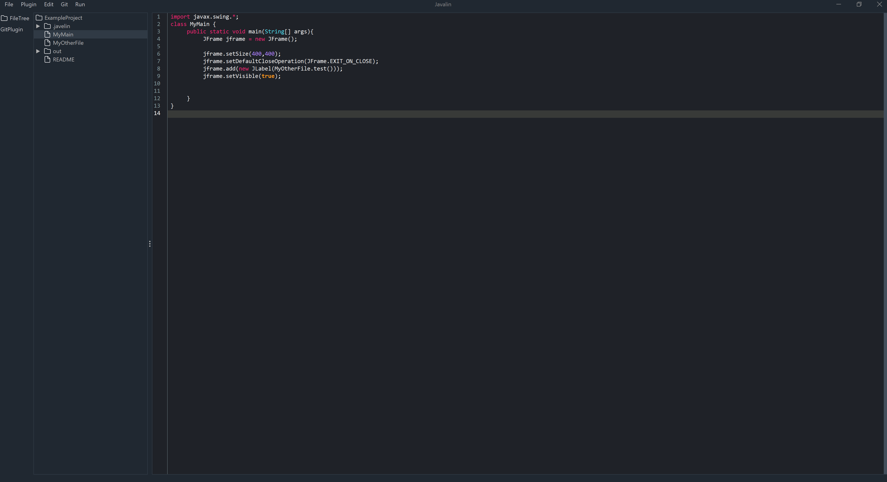

# Javelin
Very good IDE (I'm terrible at writing Swing components)


## Features
- Texteditor
  - with autosave and syntaxhighliting
- Filetree
  - with file watcher
- Plugin system
  - use or create a plugin
- Build & Run
  - build your projects
### Planned Features
- Settings Page
- Install Wizard
- Plugins
  - Git Client
  - Build System
  - Database Client
## Install
WIP
## Developer
### Develop a Plugin
[plugin-development.md](docs/plugin-development.md)
### Build & Run Locally
**Build**
```shell
cd Javalin
mvn clean install
```
**Run**
```shell
cd Javalin-UI/target
java -jar javalin-ui-1.0.jar
